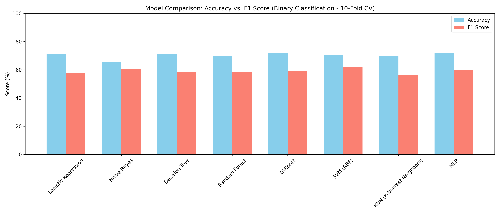

# *Nghiên cứu hệ đa tác nhân kết hợp mô hình ngôn ngữ lớn trong phát hiện tin giả*

## Giới thiệu
Đề tài “*Nghiên cứu hệ đa tác nhân kết hợp mô hình ngôn ngữ lớn trong phát hiện tin giả*” đặt ra những mục tiêu nghiên có tính ứng dụng cao, góp phần giải quyết một vấn đề nhức nhối trong thời đại thông tin số. Dưới đây là phân tích chi tiết về từng mục tiêu: 
Mục tiêu chính: Xây dựng hệ thống phát hiện tin giả hiệu quả và tự động

- Phát triển hệ thống Multi-Agent AI tự động thu thập, phân tích, xác minh tin tức. 
- Giảm phụ thuộc vào con người, tăng tốc độ, độ chính xác nhận diện tin giả. 
- Tối ưu hóa độ chính xác của kết quả phát hiện tin giả

## Mô tả dữ liệu
### Background
Bộ dữ liệu LIAR bao gồm 12.807 tuyên bố ngắn được thu thập từ trang web kiểm tra sự thật Politifact, với mỗi tuyên bố được gắn nhãn thủ công bởi các biên tập viên chuyên nghiệp theo sáu mức độ chính xác:  
- pants-fire
- false
- barely-true
- half-true
- true
- mostly-true

Các nhãn này phản ánh mức độ xác thực của tuyên bố, từ 
hoàn toàn sai (pants-fire) đến hoàn toàn đúng (true), cung cấp một phổ đánh giá chi tiết cho nhiệm vụ phân loại tin giả.

### Sample
- Mỗi mẫu trong LIAR bao gồm:
  - Tuyên bố chính (statement)
- Và các siêu dữ liệu liên quan như:
  - Người phát ngôn (speaker) 
  - Chức vụ (job title)
  - Đảng phái (party affiliation) 
  - Bối cảnh phát ngôn (context)
  - Tiểu bang liên quan (state)
  - Chủ đề (subject)


## Mô tả hệ thống MAS


Luồng làm việc:
1. Phân tích văn bản (ClassifyAgent): Tác nhân này nhận tuyên bố dưới dạng văn bản và sử dụng prompt được thiết kế để phân tích ngữ nghĩa, ngữ cảnh, và các dấu hiệu sai lệch. Kết quả đầu ra là một JSON chứa nhãn dự đoán và độ tin cậy **{"label": "false", "confidence": 0-1.0}**
2. Đánh giá siêu dữ liệu (AnalysisAgent): Tác nhân này phân tích siêu dữ liệu của tuyên bố, bao gồm thông tin về người phát ngôn như tên, chức vụ, hoặc đảng phái, để đưa ra điểm số độ tin cậy **{"confidence": 0.0-1.0}**
3. Tìm kiếm web (SearchAgent): Tác nhân này sử dụng công cụ GoogleSearch để thực hiện tìm kiếm web với tuyên bố làm truy vấn, trả về tối đa ba kết quả dưới dạng danh sách JSON, mỗi kết quả chứa tiêu đề và nội dung tóm tắt. Công cụ này đóng vai trò quan trọng trong việc cung cấp bằng chứng bên ngoài để xác minh tuyên bố.
4. Xác định độ chính xác (FactCheckerAgent): Tác nhân này so sánh tuyên bố với kết quả tìm kiếm web từ SearchAgent, đánh giá xem tuyên bố được hỗ trợ, mâu thuẫn, hay không rõ ràng. Kết quả là một điểm số độ chính xác **{"confidence": 0.0-1.0}**
5. Tổng hợp (AggrAgent): Tác nhân này nhận đầu ra từ ClassifyAgent, 
AnalysisAgent, và FactCheckerAgent, áp dụng logic tổng hợp để đưa ra nhãn cuối cùng **{"final_label": "True/False"}**

## Cài đặt

1. Install libraries
```console
pip install -r requirements.txt
```
2. Run zero-shot prompting 
```console
python zero_shot.py
```
3. Run few-shot prompting
```console
python few_shot.py
```
4. Run multi-agent
```console
python workflow.py
```

5. Evaluate

Đối với zero-shot và few-shot:
```console
python evaluate.py
```
Đối với multi-agent
```console
python models.py
```

## Experimental

1. Chart comparison


2. Results

| Model                             | Mean Accuracy (%) | Sources |
| --------------------------------- | ----------------- | ------- |
| Ensemble với TF-IDF               | 63,9              | [1]     |
| RoBERTa base                      | 62,0              | [1]     |
| BERT base                         | 63,0              | [1]     |
| Hồi quy logistic (tối ưu hóa)     | 63,5              | [2]     |
| BERT (cơ bản)                     | 63,5              | [2]     |
| BERT (tối ưu hóa)                 | 63,5              | [2]     |
| Naive Bayes (Bigram)              | 60,0              | [3]     |
| CNN                               | 58,0              | [3]     |
| Bi-LSTM                           | 58,0              | [3]     |
| Conv-HAN                          | 59,0              | [3]     |
| BERT                              | 62,0              | [3]     |
| RoBERTa                           | 62,0              | [3]     |
| DistilBERT                        | 60,0              | [3]     |
| ELECTRA                           | 61,0              | [3]     |
| ELMo                              | 61,0              | [3]     |
| ELMo                              | 61,0              | [3]     |
| ELMo                              | 61,0              | [3]     |
| Zero-shot                         | 66.9              | Ours    |
| Few-shot (3-shot)                 | 68.4              | Ours    |
| Multi-Agent + Naive Bayes         | 65.3              | Ours    |
| Multi-Agent + Logistic Regression | 71.1              | Ours    |
| Multi-Agent + Decision Tree       | 68.4              | Ours    |
| Multi-Agent + Random Forest       | 68.8              | Ours    |
| Multi-Agent + SVM (RBF)           | 71.4              | Ours    |
| Multi-Agent + KNN                 | 69.1              | Ours    |
| Multi-Agent + MLP                 | 71.9              | Ours    |

### References

1. A Comparative Study of Machine Learning and Deep Learning Techniques for Fake News Detection (MDPI, 2022)
2. A Comprehensive Benchmark for Fake News Detection (PMC, 2022)
3. A benchmark study of machine learning models for online fake news detection (ScienceDirect, 2021)